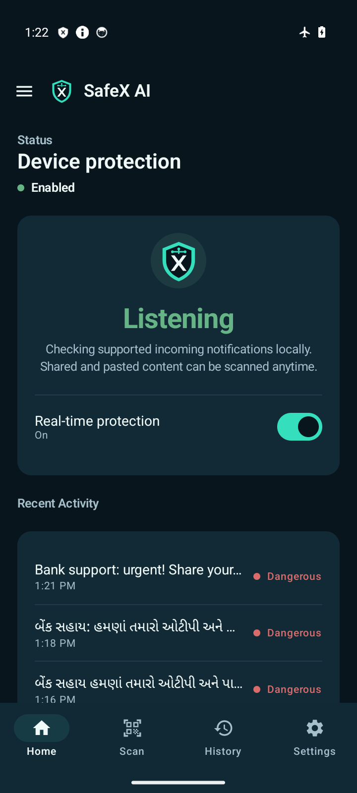
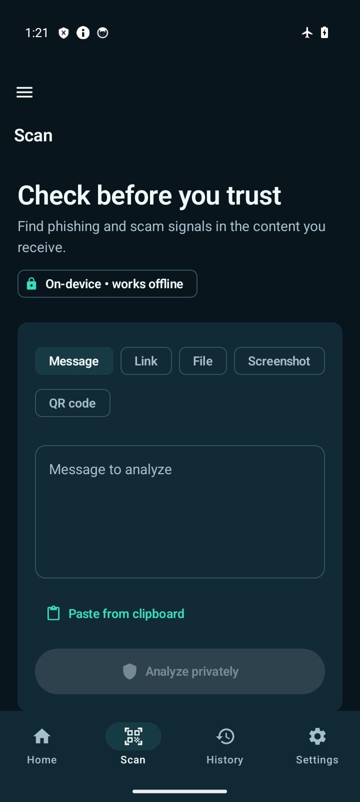
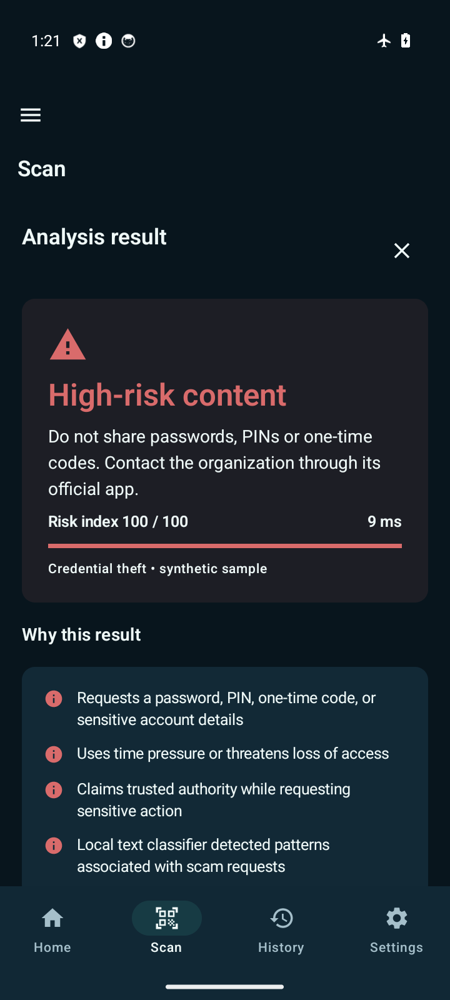

# SafeX AI

An Android security assistant for checking suspicious messages, links, screenshots, live or selected-image QR codes and files on the device. Built for a privacy-focused hackathon demonstration.

## What works

- Shared messages, selected text and manual input use the same local scam analysis.
- Links combine 26 structural rules, a bundled TensorFlow Lite classifier and an optional imported local threat list.
- Supported app notifications are checked after the user enables Android notification access. Findings produce a private warning with saved explanations.
- Bundled OCR reads screenshot text; foreground camera and selected-image QR scans use bundled offline recognition.
- UPI instruction review shows unverified recipient details and supports expected address/amount comparisons.
- Domain explanations identify the actual destination, Unicode spelling and visible embedded hosts.
- Context questions can add saved caution, and incident checklists help after clicks, disclosure, installation or payment.
- Threat notifications include a custom warning tune, a labeled test and Android sound settings.
- File checks inspect names, signatures and bounded archive contents, including disguised Android packages.
- Results explain evidence and limitations. Blocked links have no open action; suspicious links require confirmation.
- Searchable local history, deletion, retention, per-app controls and themes.
- Full English, हिन्दी and ગુજરાતી interface selection, translated warnings and adjustable text size (85–150%).
- Native Hindi/Gujarati scam checks and bundled offline screenshot recognition in all three scripts.
- Original SafeX shield/X logo with a consistent teal/navy interface.

The installed app has **no INTERNET permission**. Inference works offline; there is no server or API key to configure. Android decides which notifications and links it exposes to the app.

## Run

Open `android-app` in Android Studio with Java 17 and Android SDK 34, or run:

```sh
cd android-app
./gradlew :app:assembleDebug :demo-sender:assembleDebug
```

Install `app/build/outputs/apk/debug/app-debug.apk`. The optional `demo-sender/build/outputs/apk/debug/demo-sender-debug.apk` posts clearly labeled local fixtures to demonstrate actual notification capture in debug builds.

See [the 1.4.0 practical features](docs/practical-features.md), [setup](docs/setup.md), [demo rehearsal](docs/demo.md), [privacy](docs/privacy.md), [features and scope](docs/features.md), [architecture](docs/architecture.md), [model card](docs/ml-model.md), [languages and branding](docs/languages-and-branding.md), and the [project audit and upgrade plan](docs/hackathon-upgrade-plan.md).

## Screenshots

| Home | Scanner | Result |
| --- | --- | --- |
|  |  |  |

[History](docs/screenshots/history.png) · [Settings](docs/screenshots/settings.png) · [Hindi](docs/screenshots/settings-hindi.png) · [Gujarati, larger text](docs/screenshots/settings-gujarati-150.png)

[SafeX logo SVG](branding/safex-logo.svg) · [Language controls and brand guide](docs/languages-and-branding.md) · [Gujarati result at 150%](docs/screenshots/scam-result-gujarati-150.png)

## Validation

See the [verification report](docs/validation.md) for measured checks and limitations.

```sh
cd android-app
./gradlew :core:testDebugUnitTest :agents:testDebugUnitTest :ui:testDebugUnitTest :app:testDebugUnitTest :app:lintDebug
./gradlew :app:connectedDebugAndroidTest
```

Device tests exercise native URL inference, the real local analysis pipeline, OCR, QR extraction, disguised APK detection, persistence, model score parity, and absence of Internet permission.

## Model honesty

The URL classifier now has reproducible training using the licensed UCI PhiUSIIL historical dataset, domain-disjoint splits and explicitly synthetic URL variants that reduce dataset source bias. Held-out historical results and authored robustness checks are reported separately; neither proves current-world accuracy. The text classifier remains a prototype trained on 100 authored synthetic multilingual examples with 36 validation examples. Models can raise warnings and cannot independently block content or certify safety. See the [model card](docs/ml-model.md) and [fraud-link pattern list, gaps and verification](docs/fraud-link-audit.md).

## Stack

Kotlin 2, Jetpack Compose / Material 3, Hilt, Room, coroutines, WorkManager, TensorFlow Lite, bundled ML Kit Latin/Devanagari OCR, Tesseract Gujarati OCR and ML Kit QR models. Minimum Android 8 / API 26; target and compile API 34. Modules: `app`, `core`, `agents`, `services`, `ui`, and optional `demo-sender`.
