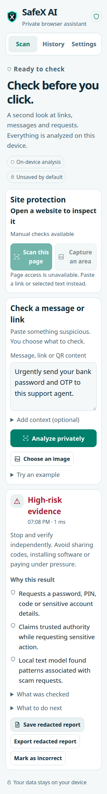
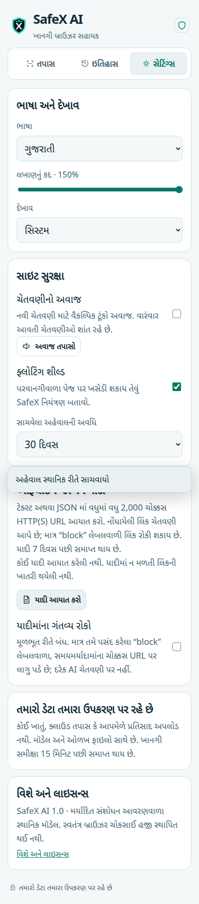
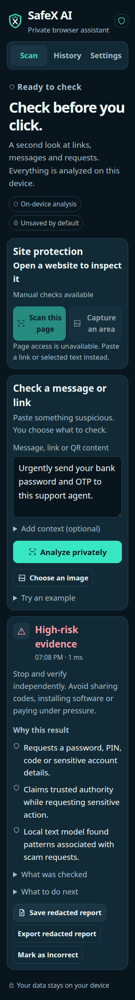

# SafeX AI Chrome 1.0.0 — implementation and validation

**9 October 2026.** The desktop companion is implemented in `chrome-extension/`, with a reusable TypeScript security engine in `shared/security-engine/`. It builds into a Manifest V3 extension using the original SafeX shield/X and teal/navy branding.

[Installation and demo instructions](../chrome-extension/README.md) · [Original plan](chrome-extension-plan.md) · [Release verification](test-results/chrome-extension-summary.json)

## Delivered behavior

| Area | Working behavior |
| --- | --- |
| Private checking | Paste a message, URL or QR payload; select text or right-click a link; inspect the authorized current page. Inputs stay on the device. |
| Detection | Adapted multilingual action rules, local text classifier, 15-feature URL classifier, structural URL checks, public/private suffix resolution, Unicode brand checks and exact imported-list matches. |
| Browser context | Compare displayed link addresses with actual destinations; inspect sensitive field types and form destinations without reading values. Ordinary HTTPS login and external SSO controls are included in development tests. |
| Site monitoring | Explicit optional site permission, bounded rescans after meaningful changes, pause/resume, revocation and navigation invalidation. Automatic extraction excludes known inbox/chat contents. |
| Point-of-action warnings | Guard supported primary clicks on identified risky links; show Review, Dismiss and Continue this click. Guard submissions to identified risky sensitive form actions without replaying a form. |
| Advanced input | Active-tab capture, preview and pointer crop; deliberate image import; local three-script OCR, editable text, separate QR decoding and UPI expected-payee/amount review. |
| Practical guidance | Optional context questions and an action checklist. User-supplied answers remain distinguishable from detected evidence and cannot independently certify fraud. |
| Accessible reading | English/Hindi/Gujarati selection, 209 translated strings per language, 85–150% text scaling, light/dark/system themes, visible keyboard focus and reduced motion. Floating warnings also follow text scaling. |
| Private records | Explicit redacted saving/export, incorrect-result feedback, deletion and bounded retention. Export includes an incorrect-result marker when the user supplied one. |
| Sound and blocking | Optional packaged sound with automatic cooldown. User-controlled exact URL blocking from explicit block entries; reported-only entries raise caution. Both features are off initially. |

No live threat is fetched simply because it appears in a scan. The extension has no analytics, account, API key or cloud inference. Browser extensions operate within Chrome's permission and page-access boundaries.

## Architecture and privacy

The MV3 background worker loads checksum-verified local model assets, performs inference and stores bounded state. The URL export reproduces the available Android model's parameters/scaler; float32 numerical fixtures check browser prediction parity. The text export uses the shipped Unicode word/bigram/character classifier and its existing context/vocabulary policy. The browser page policy adds DOM evidence and deliberately avoids treating every login instruction as credential sharing.

The content script extracts bounded visible text, link destinations and form metadata. Input values, textareas and editable descendants are excluded, including descendants nested inside labels and links. Known inbox/chat hosts return address-only coverage and an explicit selected-message fallback. Inaccessible frames and truncated content are disclosed. Page UI is shared with the website; the extension side panel is the authoritative review surface.

Privileged commands require the extension's own side-panel sender. Content-script requests are bounded and checked against the current tab and permission. The extension exposes no external-message interface or web-accessible runtime assets. CSP permits the packaged OCR WASM while restricting scripts, workers and connections to local extension resources.

Preferences, user-imported lists, explicit saved reports and minimal feedback use restricted local Chrome storage. Unsaved findings use restricted session storage with a 15-minute expiry. Original message text and image pixels are not persisted. Temporary findings can contain full inspected URLs; report saving/export removes credentials, query values, fragments, tab/document identity and payment identity. Local storage is not encrypted and redaction does not anonymize every possible path or domain. Users retain Delete, retention and list-removal controls.

OCR and QR processing are independent: a QR remains reviewable if OCR fails. Recognition can be cancelled and restarted; workers have a 90-second deadline. Accepted crops discard the full captured bitmap. Images are limited to 10 MB/16 million pixels; QR analysis uses a bounded preview and attempts up to four codes. User-reviewed cropped text can still be misrecognized.

## Verification

The final development run passed **431 unit/privacy checks and 32 browser scenarios** with no failed or skipped unit tests. TypeScript checking passed. The dependency audit found zero reported vulnerabilities at validation time. The release recorder checks every packaged file against the generated build manifest and verifies the ZIP checksum.

| Evidence | What it establishes |
| --- | --- |
| [Unit report](test-results/chrome-extension-unit.txt) | 36 text-model reference cases, 256 URL parameter/scaler reference cases, 120 authored multilingual contracts and 19 additional behavior/privacy controls. |
| [UI and offline report](test-results/chrome-extension-ui.json) | Production manifest installation; offline inference; English/Hindi/Gujarati UI and OCR; 150% text; pointer crop/cancel/restart; separate QR review; labeled context; redacted save/export/feedback; narrow-width reflow. |
| [Installed Chrome protection report](test-results/chrome-extension-protection.json) | Actual toolbar activeTab grant, local DOM exclusion, screenshot capture, rejection of untrusted privileged commands, required optional site authorization, worker termination/recovery, sound playback, site monitoring, form/click warnings, pause/resume/revoke, actual DNR blocking and navigation/restricted-page handling. |
| [Dependency report](test-results/chrome-extension-dependencies.json) | The dated npm audit result, including development dependencies. |
| [Combined release record](test-results/chrome-extension-summary.json) | Artifact bytes/SHA-256, model hashes, build-manifest hash, environments, counts and remaining evaluation limitations. |

Browser environments were installed **Google Chrome 154.0.8037.57** and **Playwright Chromium 156** on Linux, each using a temporary profile. The UI suite kept network connectivity disabled while checking inference and OCR. Its observed extension/UI requests remained local. The protection suite used local synthetic pages. Site permission was preapproved in that isolated profile and then activated through the real optional-permission API; human interaction with Chrome's confirmation dialog was not automated.

The older Gujarati language asset emits two known Tesseract parameter warnings (`classify_misfit_junk_penalty` and `merge_fragments_in_matrix`). They are recorded separately. Gujarati recognition completed, and page/CSP runtime errors were absent. The Unicode OCR assertions establish functioning packaged recognition, not a measured character-error rate.

## Screenshots

| Light result at 320 px | Gujarati settings at 150% | Dark result |
| --- | --- | --- |
|  |  |  |

## Accuracy and remaining work

Passing reference and authored fixtures does **not** establish independent real-world accuracy. This release reuses the existing research models and adds browser context; it has not trained a new browser classifier on a fresh independently labeled holdout. Android's historical model/pipeline metrics must not be presented as browser metrics. English/Hindi/Gujarati controls demonstrate functionality, with no established native-language population recall or false-warning rate.

The plan's fresh-data accuracy milestone remains open. It requires campaign/domain/time-grouped data, independent labels, a frozen holdout, threshold selection on validation only, browser-specific legitimate controls, and explicit unknown/coverage measurements. More brand or language coverage should follow that evaluation rather than merely adding aggressive rules.

Other remaining work is layout-specific webmail/chat adapters, authenticated publisher-controlled remote updates, a wider desktop/browser compatibility matrix, manual assistive-technology evaluation, and Chrome Web Store publisher/support information and submission. A required permission is declared for DNR blocking; the actual rules remain empty until the user enables blocking with explicit block entries.

Coverage is limited to the visible authorized main document and deliberate inputs. Modified clicks, new-tab navigation, redirects, scripted navigations/submissions, inaccessible frames, unseen communications and full downloaded-file inspection are not comprehensively guarded. Short links are not followed. UPI identity remains unverified. Expired imported entries stop contributing risk; installed DNR rules are removed during scheduled cleanup/startup, subject to Chrome alarm scheduling.

## Distribution and rehearsal

The generated unpacked folder is `chrome-extension/dist/`. The ZIP is `chrome-extension/release/SafeX-AI-Chrome-1.0.0.zip`, with `release/checksum.json`. Extract the ZIP, open `chrome://extensions`, enable Developer mode and Load unpacked from the extracted folder. Store publication has not occurred.

Run `npm run demo` from `chrome-extension/` to start the local synthetic lab at `http://127.0.0.1:8787`. Demonstrate selected scam/legitimate messages, the fake login and mismatched destination, three-language reading controls, a chosen OCR/QR image, sound, and a redacted export. The local lab never records submitted values; its form also prevents submission independently of SafeX.

All demonstrations are visibly labeled synthetic. The desktop extension and the Android S24/A36 demonstration are separate validation tracks.
