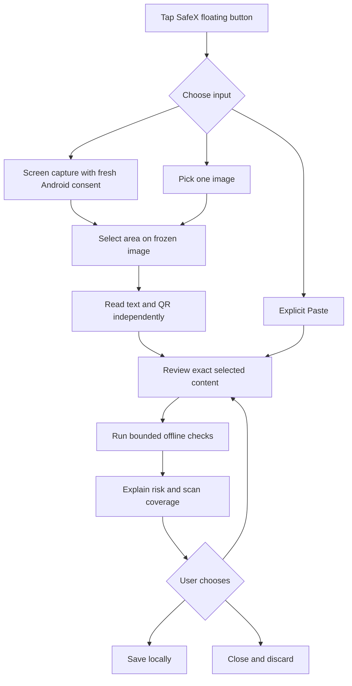
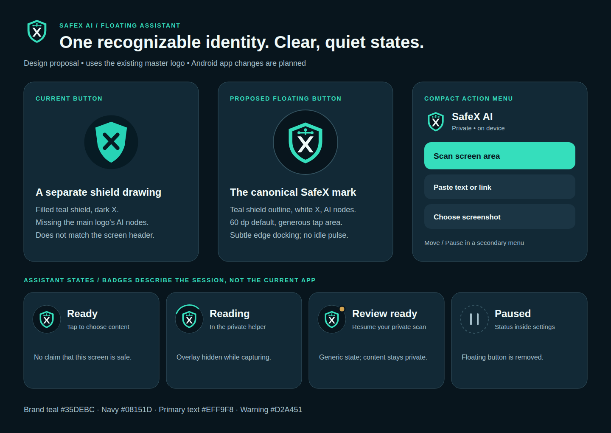

# SafeX AI floating assistant — audit and enhancement plan

Prepared: 9 October 2026. Audited baseline: **1.5.0, version code 6**. The findings below describe that baseline. Engineering changes are implemented in **1.6.0, version code 7**; see [implementation status](floating-assistant-implementation-status.md) and [the updated workflow](floating-assistant-1.6.md). Independent data collection, participant studies and physical Samsung checks remain separate work.

The objective is to let an ordinary user check suspicious content in a few understandable steps, know exactly what was checked, and recover from mistakes without losing work. The first implementation priority is reliable selection, extraction and navigation; the main SafeX logo and a simpler interface ship alongside those changes.

[Logo and state preview](../branding/floating-assistant-logo-preview.svg) · [PNG preview](../branding/floating-assistant-logo-preview.png) · [Current implemented feature](floating-assistant-1.6.md) · [Verification](test-results/floating-assistant-summary.json)

## 1. What this audit establishes

Reviewed the overlay service, activity lifecycle, capture service, crop view, view model, image reader, selection model, shared scan repository, message/URL/payment checks, result screens, notification behavior, brand assets, language generator, device tests and existing screenshots. Reviewed Android's current official capture, foreground-service, accessibility and inset documentation.

This is a code and recorded-evidence audit. No new physical-phone benchmark or participant usability study was performed. Existing screenshots are authored fixtures. The logo preview is a design proposal.

The preceding release records **500 active unit tests, 35 offline Android tests, zero lint errors and 51 warnings**. Three optional research-export tests were skipped. Those figures establish tested functionality on the recorded API 34 emulator; they do not establish usability, performance on other phones, or current-world scam accuracy. The translation generator checked **714 unique translated strings** during this audit. The JSON report counts 715 nonempty catalog rows instead; report generation should use the generator's canonical unique count.

Keep the useful foundation: fresh Android consent per capture, one-frame projection, projection stopped before crop editing, bundled three-script OCR and QR recognition, explicit clipboard access, editable content, local threat explanations, private reviews until Save, secure previews and lock/expiry cleanup.

## 2. Findings and priorities

P0 means correctness or an important coverage boundary must be addressed before the next feature release. P1 means an important usability or brand improvement. P2 means subsequent polish or reporting work. **Code** findings are directly supported by implementation; **visual** findings are observations from recorded images; **validation gap** means behavior still needs testing rather than a confirmed runtime failure.

| ID | Priority / evidence | Finding | Required outcome |
| --- | --- | --- | --- |
| F01 | P0 / code | Back always calls `close()` and resets the entire session. There is no step-wise return from review to crop or result to input. | Back returns one step; Close discards deliberately; original reviewed input can be revised and scanned again. |
| F02 | P0 / code | Removing the last selected line restores all extracted text. Editing or using all text can also overwrite earlier corrections. | Explicit All / Selected / Edited modes; zero selected lines means zero selected content; edits survive mode changes or request deliberate replacement. |
| F03 | P0 / code | QR, Latin, Devanagari and Gujarati extraction execute in one chain. An exception in one component can discard useful outputs from another. | Independent engine outcomes; usable QR/text retained; failed or skipped coverage disclosed; no complete-check claim for partial extraction. |
| F04 | P0 / code | `ExtractedLine` lacks quality/status fields; low-confidence Gujarati output can disappear without an extraction-coverage warning. A legible filler line could remain while risky text is missed. | Separate extraction quality from threat severity; script/engine status and meaningful unresolved readings shown. |
| F05 | P0 / code | URL candidates are extracted only with `http(s)://` or `www.`. Bare domains, defanged links and line-wrapped screenshot URLs are not consistently surfaced. | Shared conservative candidate parser; original spelling visible; ambiguity acknowledged; no silent domain repair or navigation. |
| F06 | P0 / code | The default crop excludes margins, review uses a small fixed preview, and there is no return to the original frame after successful OCR. | Obvious crop boundary, legible zoom/inspection, and an explicit Change area action while the bounded private session is retained. |
| F07 | P0 / code + validation gap | Claimed pixels/text/results live in an activity ViewModel; gateway handoff survives activity destruction, but a completed private review is not a session store that can be recovered after activity destruction. | A single in-memory session owner with explicit expiry; configuration/activity recreation retains the review; process death clears it and explains recovery. |
| F08 | P1 / code + visual | The floating button draws its own filled shield/dark X; the header uses the canonical outlined shield/white X/AI nodes. | Reuse the master vector drawable in the floating button and menu header; remove duplicate hand-drawn brand geometry. |
| F09 | P1 / visual + code | At 150% text size, long setup explanations fill the first viewport and push Enable below it. | Compact setup with primary action immediately reachable; detailed privacy explanation expandable. |
| F10 | P1 / visual + validation gap | The pasted-content screenshot does not show the scan action. The test checks a scrollable click action, not a completed large-font/keyboard workflow. | Primary action kept reachable with keyboard open; real tap-to-result tests at large text sizes, not just node existence. |
| F11 | P1 / code + visual | Six equal-looking menu buttons compete for attention. Pause, Close and Move look as important as Scan. Outside-tap/back dismissal is not implemented. | Three clear primary routes; secondary controls separated; dismissal behavior cannot accidentally trigger a source-app action. |
| F12 | P1 / code | Errors are mostly strings and multiple causes share generic recovery. QR, unsupported content and partial extraction lack a consistent status model. | Typed errors with relevant Retry / Change area / Paste / Choose image actions and accurate status labels. |
| F13 | P1 / code | Import uses `fromScreen=true`, so saved results are labeled Floating screen crop. Selected/edited provenance is also compressed into a Boolean and a replacement coverage string. | Structured source and scan scope; distinguish capture, imported image, original pasted text, OCR-edited text, selected lines, link and QR. Preserve detector coverage. |
| F14 | P1 / validation gap | The small synthetic text model and historical URL model cannot support an all-scam accuracy claim. OCR, language mixing, negation and clean compromised links remain meaningful gaps. | Evaluate complete input-to-verdict behavior with independent data, per-language/category errors and an explicit cannot-assess outcome. |
| F15 | P1 / validation gap | Real full-display capture is tested on API 34; single-app capture, rotation, OEM limits, TalkBack and physical warning audio are not fully verified. | Real-device matrix covering capture mode, denied/revoked permissions, lock, lifecycle, accessibility and sound/channel states. |
| F16 | P2 / code | Private link analysis does not wrap the whole call with the timing measurement used by ordinary link scans; the UI always prints milliseconds. | Measure capture/OCR/analysis separately; show elapsed time only when measured; never display an unmeasured zero as a speed claim. |
| F17 | P0 / code | The menu offers Paste and Choose screenshot during an active review, but `open()` returns for active stages and the activity only opens the picker from SETUP. Those new-input actions can return to the old review. | Model Resume and Start new input as different events; replacing a review is deliberate and the chosen route actually opens. |

Source evidence: [session and selection logic](../android-app/app/src/main/java/com/sentinel/ai/protection/floating/FloatingSessionViewModel.kt) (`selectLine`, `open`, `crop`, `analyze`, `reset`); [navigation](../android-app/app/src/main/java/com/sentinel/ai/protection/floating/FloatingAssistantActivity.kt) (`BackHandler`); [menu and custom logo](../android-app/app/src/main/java/com/sentinel/ai/protection/floating/FloatingAssistantService.kt) (`toggleMenu`, `Shield`); [screen layouts](../android-app/app/src/main/java/com/sentinel/ai/protection/floating/FloatingAssistantScreen.kt); [OCR](../android-app/app/src/main/java/com/sentinel/ai/protection/intent/ImageContentReader.kt); [candidate extraction](../android-app/core/src/main/java/com/sentinel/ai/core/model/MessageSignals.kt); [pipeline](../android-app/app/src/main/java/com/sentinel/ai/protection/intent/IntentScanRepository.kt); [model limitations](ml-model.md).

## 3. The proposed user journey

### Enable once, with a short explanation

Settings opens a compact card containing the main SafeX logo, current status, one sentence about private on-demand checking, and **Enable floating button**. The display-over-apps permission rationale sits directly beside that action. Notification permission is optional and has its own explanation; manual Paste/Share remains usable independently.

Keep the longer explanation behind **How your data stays private**. After a permission return, show the actual result and a next action. A denied notification permission must not look like a failed scan setup. If a channel is muted, distinguish that from missing notification permission.

### Open a small, recognizable menu

The main-logo button opens a compact menu with **Scan screen area**, **Paste text or link**, and **Choose screenshot**. When a private session exists, **Resume review** is clearly available. Paste/import/new capture must actually enter the chosen route rather than silently resume the previous review. Replacing unsaved edits requires a clear discard choice; canceling the new picker/consent should retain the existing review when possible. Move, Pause and settings belong to a secondary menu. One close control dismisses the menu.

Use a 60 dp default button with a minimum 48 dp touch target. Offer a bounded optional size preference and left/right placement. Drag uses Android touch slop, handles cancellation, docks smoothly and respects cutouts, gestures, rotation and visible window insets. No endless idle animation. Only the transient open menu may use a dismiss surface; the idle overlay remains small.

### Capture → select area → review → understand

Fresh capture consent remains necessary for every new capture. Android requires session-specific consent and single-use projection authorization; reusing a previous token is not a valid speed optimization. [Android capture requirements](https://developer.android.com/media/grow/media-projection).

### Crop screen

Use the frozen image as the main work area, with a clear selection rectangle and compact **Area → Review → Result** progress indicator. Default to the full image or an explicitly labeled suggestion; do not silently imply the default excludes nothing. Keep **Read selected area** in a stable, reachable action area.

Support fit-to-image, zoom, bounded pan while zoomed, reset, accessible precise controls, and a magnified handle aid if usability testing supports it. Optional rotate controls help imported images. Automatic text-area suggestions are optional suggestions requiring confirmation; a QR-only crop must remain valid.

**Back** returns to the prior step. **Change area** restores the retained original image without a new Android capture. **Capture again** explicitly obtains fresh consent. Keep the original frame only while needed within the bounded private session; retain the original and crop only within one active session and an aggregate pixel-memory budget, then dispose them on Close/lock/expiry or a deliberate session replacement. If memory pressure requires earlier release, label recropping as needing a new capture instead of offering a broken Change area action. Reviewed text remains available for Edit and rescan while the session is active.

### Review screen

The default view contains readable extracted text, a compact source preview and an explicit scope selector: **Message**, **Selected text**, **Links**, **QR codes**. Only show tabs with relevant content; explain how to choose lines. Scope is visible beside the primary action.

Selection must be predictable. “0 lines selected” disables selected-text analysis. Switching to all text is an explicit action. Editing creates a separate draft; selecting lines must not quietly replace corrected text. A user can discard edits deliberately or return to their draft.

Recognized links show the complete domain and readable destination, with full content expandable. Do not truncate away the destination that matters. A selected link can offer **Check link with message context** as a separate, clearly scoped action. QR entries identify the payload type and never open a website, payment app or executable action automatically.

Keep the primary action accessible with the keyboard open. Use component-aware system/IME inset handling and a scrollable editor without double-applying padding. The recorded screenshot alone does not establish the cause of the missing action. Validate actual keyboard transitions and taps. [Android inset guidance](https://developer.android.com/develop/ui/compose/system/insets-ui).

### Result screen

Lead with **High-risk content**, **Review before acting**, **No strong signals found**, or **Could not assess reliably**. The last state describes insufficient readable/supported content; it is separate from the internal ALLOW/WARN/BLOCK security decision and never weakens existing strong evidence.

Show one understandable next action, up to three main reasons and an expandable **See all evidence** section. Surface coverage near the verdict: selected input, readable/extracted content, checked link count, unavailable checks and offline limits. The risk index is an evidence score, not a percentage probability of fraud; keep that explanation available and avoid “100% safe” wording.

Use one header and one clear completion control. The current shared result has its own header, X and Done in addition to the floating header; make shared-result chrome configurable rather than changing the ordinary scanner's behavior globally. Offer **Edit and rescan**, **Save result**, and **Done**. The saved state is visible and repeat Save cannot create duplicates. Existing domain identity, UPI comparisons and incident help remain accessible.

## 4. Main logo and visual system

Reuse [the canonical SVG](../branding/safex-logo.svg) and [Android vector](../android-app/core/src/main/res/drawable/safex_logo.xml). The shield represents protection, the X represents stopping threats, and the connected nodes represent on-device analysis. Preserve that geometry, white X and teal nodes.

Replace `FloatingAssistantService.Shield.onDraw()` brand paths with the master drawable rendered inside a restrained circular surface. Use the same asset in the compact menu header and keep `SafeXLogo` in Compose. Share theme tokens with native overlay views instead of hard-coded alternative teal values. Verify legibility on light/dark source apps, small sizes and all app themes.

| Role | Existing brand token / design requirement |
| --- | --- |
| Main brand teal | `#35DEBC` |
| Dark background | `#08151D` |
| Raised surface | `#122936` |
| Primary text | `#EFF9F8` |
| Secondary text | `#A5BFCA` |
| Caution | `#D2A451`, with icon and text |
| High risk | `#D96B6B`, with icon and text |
| Spacing | Consistent 8 / 12 / 16 / 24 dp rhythm |
| Shapes | Restrained round corners and subtle elevation; no heavy glow |

The shield remains the brand mark. Neutral session badges may indicate review ready; risk belongs to the private result. Idle teal never means the current app or screen was checked. During consent/capture/helper review the external overlay stays hidden. Paused means the external button is removed; paused artwork is only an in-app status.

## 5. Detection improvements that matter

### Separate “read correctly” from “contains risk”

Add extraction metadata for each engine: completed, failed, unavailable, timed out or intentionally skipped. Retain successful outputs independently. Record image dimensions/downsampling, cropped area, extraction bounds, reading alternatives and truncation. Add line quality where an engine supplies it; do not invent a universal confidence percentage across different engines.

If QR succeeds but text fails, offer QR review and explain text was not read. If text succeeds but QR fails, preserve text and explain QR coverage. If only part of mixed-language content is readable, show limited coverage and avoid an unconditional complete/clean verdict. Strong established threat evidence remains actionable even with partial extraction. A clear empty reading is not a safe result.

### Preserve meaning while handling links

Create one `ContentCandidateExtractor` that uses the existing URL normalizer, preserves original offsets/spelling and provides inspection-only normalization. Cover bare domains, `www`, visible line wraps, IDNs/punycode, zero-width characters, defanged `hxxp` / `[.]`, encoded destinations and unsupported schemes. Ambiguous OCR repairs remain proposals the user confirms; do not silently change `O/0`, `l/1`, a host, path case or payment identifier.

Treat URL-like strings conservatively to avoid interpreting email addresses or version numbers as links. Use bounded candidates, disclose skipped links, and preserve source context. Use the same parser across pasted text, screenshots, QR, shared text and selected-text entry points. Keep the existing URL rules, public-suffix handling and native model rather than replacing them with a second weaker checker.

### Evaluate more realistic communications

Extend representative cases across English, Hindi, Gujarati, Hinglish and mixed-script content: credential/OTP requests, bank/KYC impersonation, delivery/customs messages, job/task fees, rewards/refunds, investment claims, payment/QR requests, remote-access pressure and coercion. Include legitimate reminders, user-initiated OTP instructions, trusted-domain mentions in malicious messages, quoted scams, safety advice and negation. Existing rules already cover some of these; validate gaps before adding overlapping rules.

Classify QR payloads explicitly: web URL, UPI instruction, text, contact/Wi-Fi or unsupported/deep-link action. Recipient names and UPI syntax do not verify identity. Keep expected address/amount checks and explain their meaning. Unsupported or unreadable payloads must be disclosed; never launch them automatically.

The current text classifier has only 100 synthetic training examples and 36 synthetic validation examples; its reported model-only recall is 61.1% on 18 synthetic scam examples. That is not complete-pipeline recall. The URL model has historical/source limits and its development test partition was inspected. Create fresh sealed evaluation data before claiming an accuracy improvement. [Model card](ml-model.md).

### Measure improvement, then retrain

Build a versioned test corpus with authorized/de-identified material, recorded labels and source/license information. A starting evaluation budget is at least 200 scam and 200 benign originals per supported language, expanded where category coverage is weak. This is a proposed collection budget, not existing data. Keep scam-family/source/domain/time groups separate across training, validation and final evaluation; near-duplicates and OCR variants stay in their source group. Do not train on final evaluation examples or users' private scans.

Measure complete-pipeline precision, recall, false-warning rate, abstention/limited-coverage rate and confidence intervals by language and category. Measure OCR character errors plus domain/UPI/amount errors, with emphasis on harmful field changes. Report rule-only, model-only, OCR-plus-pipeline and final combined performance separately. Freeze a baseline, add fixes, and compare on the same sealed evaluation. Investigate benign regressions before changing thresholds.

No numeric real-world accuracy target is certified today. Select deployment thresholds against the measured false-warning/missed-scam tradeoff. Models may add caution, cannot independently certify safety, and cannot erase stronger rule or user-context evidence.

## 6. Session and reliability architecture

Use one bounded, in-memory `FloatingSessionController`, injected into the activity ViewModel and services. It owns a session ID, input provenance, bitmap references, reviewed draft, explicit selection mode, extraction coverage and result. ViewModels render session state; Android authorization remains one-shot and never becomes session-persisted state.

Use typed states/events and a generation counter so old OCR/analysis completions cannot update a new session. Preserve usable drafts on recoverable failure. Serialize or otherwise safely manage native recognizer lifetime; coroutine timeout does not prove native blocking work stopped. Release image resources only after their consumers finish. Keep the existing capture single-reader/idempotent-resize regression fixes.

Lifecycle requirements: Back navigates; Close deliberately discards; background review has the documented bounded expiry; lock clears immediately; process death clears and gives an honest unavailable-session route; activity recreation can resume the same still-live session. A warning or resume notification opens only its matching active session, otherwise offers a new scan. Never resurrect private results from unrelated stale pending intents.

Add structured provenance and coverage to result persistence with safe defaults/migration for historical rows. Sources distinguish screen capture from imported screenshots and original pasted content. Save writes exactly the displayed result once, including context and coverage; analysis itself emits no history event.

Overlay geometry must use actual available bounds/insets instead of fixed 32/48 dp assumptions. Observe permission/theme/language changes, handle `ACTION_CANCEL`, recompute menu placement on rotation, and test denied foreground starts. Android 15-targeted background service exceptions involving overlay permission require a currently visible overlay; keep capture starts attached to the visible consent flow and handle denial explicitly. [Android foreground-start rules](https://developer.android.com/develop/background-work/services/fgs/restrictions-bg-start).

## 7. Error and recovery behavior

| Situation | User sees | Available action |
| --- | --- | --- |
| Capture denied | “Screen capture wasn't allowed.” | Paste / Choose screenshot / Try capture again |
| Protected or unreadable area | “This area couldn't be read.” Do not claim to know the exact protection cause from black pixels alone. | Change area / Share or Paste |
| Empty clipboard | “Nothing available to paste.” | Type content / Paste again |
| Too long | Content-type-specific limit and retained input | Select a smaller portion / Edit |
| Some OCR engines fail | Readable content plus limited-coverage explanation | Review available content / Retry / Change area |
| Ambiguous domain or amount | Original image/string and disputed characters | Correct deliberately / Use original copied content |
| Timeout or memory pressure | Clear stopped/error state; retained draft when safe | Retry / Smaller image or area / Paste |
| Save fails | Result stays private and visible | Save again / Done without saving |
| Session expired or process restarted | “Your private review is no longer available.” | Start a new scan |
| Overlay permission revoked | Accurate paused/unavailable status | Re-enable / Continue manual checking |
| Warning audio muted/denied | Actual permission/channel state, with Android controlling playback | Sound test / Android channel settings |

Avoid technical exceptions in user-facing text. Background notices stay generic. Use the existing SafeX tune only for deliberate warning behavior; capture/status remain silent, and a new sound option must respect Android channel settings, volume and Do Not Disturb. Physical speaker testing is required for the presentation phone.

## 8. Language, accessibility and motion

All new trusted labels and recoveries go through the existing English/Hindi/Gujarati catalog and placeholder validation. Keep captured/typed text and destinations unchanged. Use language-aware descriptions, accessible state announcements, predictable focus order and keyboard actions. Selection can be completed with the accessible line list and crop controls without dragging or interpreting color alone.

Test app text scale 85%, 100% and 150%, then system text scaling through 200% in combination. Test TalkBack and switch/keyboard access, narrow screens, landscape, keyboard open/closed, light/dark themes and long Gujarati/Hindi labels. Shared tokens must account for text contrast and icons; validate actual contrast rather than assuming brand teal works on every background. Announce extraction completion and errors without flooding speech.

Animate docking, stage changes and busy state briefly; honor disabled/reduced animations and stop animation while paused/idle. Optional haptics must be user-controllable. [Android accessibility guidance](https://developer.android.com/develop/ui/compose/accessibility).

## 9. Implementation order and concrete deliverables

Effort ranges are estimates for focused development, excluding unavailable phones/data and external review. Each phase ends with reviewable code, relevant tests and updated evidence. Proposed next release numbering is decided when packaging.

| Phase | Work | Deliverable / exit condition | Estimate |
| --- | --- | --- | --- |
| A | F01–F04, F07, F17: session navigation, selection semantics, independent extraction and coverage | No unexpected selection broadening or draft loss; engine-failure and stale-completion regressions pass | 2–4 development days |
| B | F08–F11: canonical logo, compact setup/menu, responsive action layout | Main logo in bubble/menu/header; primary routes reachable; all-language large-font tap-to-result journeys pass | 2–3 days |
| C | F05–F06, F12–F13: link candidates, crop recovery, QR types, provenance and typed errors | End-to-end scope accurately shown; supported/unsupported routes recover correctly without opening content | 3–5 days |
| D | F14: independent corpus, failure analysis, targeted rule/model updates | Versioned sealed evaluation and measured comparison; no accuracy claim from regression fixtures alone | Data-dependent; overlaps development |
| E | F15–F16: device usability, lifecycle/sound/performance checks, reporting | Physical-phone evidence, actual timings, accessible demo and installable release artifact | 2–3 days after devices are available |

For the hackathon, prioritize A and B, then the bounded candidate/QR/coverage work in C and the presentation-phone checks in E. Dataset research continues separately; do not delay a stable demo to advertise an unvalidated replacement model.

### Files affected

- `FloatingAssistantService.kt`: canonical drawable, menu hierarchy, touch/placement/dismissal behavior and shared native theme tokens.
- `FloatingAssistantActivity.kt`: navigation, explicit discard, permission recovery and matching-session resume.
- `FloatingSessionViewModel.kt`: wrap a single session owner; selection/draft/provenance state; typed operations/errors and measured timings.
- `ScreenCropView.kt` and `FloatingAssistantScreen.kt`: adaptive crop/review layout, zoom/pan, accessible selection and primary actions.
- `ImageContentReader.kt` and `ScreenSelection.kt`: independent engine results, quality/coverage data and bounded alternatives.
- `MessageSignals.kt`, URL normalization adapters and `IntentScanRepository.kt`: shared candidate extraction and truthful aggregated coverage.
- `ScanResult` / persistence: provenance/coverage compatibility and explicit Save semantics.
- `ScanResultScreens.kt`: optional shared chrome, concise reasons, reliable Edit/rescan and coverage presentation.
- `FloatingNotifications.kt`: typed recovery, matching active-session links and accurate permission/channel status.
- Language catalog, `SafeXLogo`/vector usage, native/UI tests, validation report generator and feature/demo documentation.

## 10. Acceptance and validation plan

Treat these as release gates, not results already obtained.

| Area | Acceptance evidence |
| --- | --- |
| Navigation | Crop/review/result Back and Edit preserve intended input; active-review Paste/import/new capture opens the correct route; explicit Close and lock clear it; replacing a session is deliberate. |
| Selection | All/Selected/Edited are distinguishable; deselecting the last line never scans all; switching scopes cannot erase edits silently. |
| Extraction | Each OCR/QR failure permutation preserves successful components; unavailable/partial content cannot produce a complete-check claim. |
| Candidate handling | Original domains/paths/UPI identifiers retained; bare/defanged/wrapped cases and benign look-alikes handled; ambiguous corrections require confirmation. |
| Race conditions | Cancel/reset/new capture/import during work cannot receive a stale result or unsafe bitmap reference; Save cannot duplicate a displayed result. |
| Privacy | No INTERNET permission, private Room writes only after Save, no screenshots/text/tokens in logs/files/notifications, protected previews retained. |
| Interface | Full real tap-to-result journeys for all three languages at large text sizes and with keyboard open; TalkBack can select and analyze. |
| Android capture | Full-display and single-app captures, actual dimension changes, rotation, denial, system Stop, lock and repeated static screens tested. |
| Failure recovery | Errors lead to the advertised retry/input route; no frozen spinner after cancellation/timeout or false success on empty input. |
| Notifications/audio | Allowed/denied permission, muted/blocked channel and DND scenarios represented honestly; physical warning tune heard when Android allows it. |
| Branding | Same canonical mark in floating button/header/menu; recognizability and contrast verified on light/dark source apps and small sizes. |
| Evaluation | Per-language/category pipeline metrics with independent split information, failure examples and limitations; no synthetic-only accuracy claim. |

Device matrix: one presentation phone first, then a stock Android device and at least one device with aggressive background limits. Cover the supported minimum API 26 route, API 34, and newer Android versions relevant to the actual target/update. API 35/36 behavior deserves dedicated testing during target-SDK work. Choose actual available devices; do not describe unrun combinations as verified.

Usability pilot: recruit 6–9 consenting participants covering the three languages, including someone who prefers larger text. Tasks: enable the assistant, scan a screenshot, select one link, correct a reading, backtrack, save once, recover after denial, and pause it. Record task completion, first successful check time, mistaken actions and comprehension of the verdict/coverage. Measure errors using authored content; do not record private communications. The proposed success target is at least 90% completion of core tasks with no silent content-selection mistakes; the pilot is qualitative evidence, not a population-wide UX guarantee.

Provisional responsiveness goals on named representative phones: immediate visible feedback within 100 ms, warm local text/link analysis P95 under one second for the agreed fixture sizes, and normal cropped OCR P95 under five seconds. These are **targets, not current benchmarks**. Measure cold/warm capture, OCR and analysis separately; record low-memory/large/mixed-script cases without hiding slow paths. Consent and human editing time are reported separately. Any failed target triggers optimization or a revised honest scope.

## 11. Practical demo and mentor message

Demonstrate the same master SafeX logo over an authored conversation, fresh Android consent, crop, reviewed OCR, one selected link, visible offline coverage and a private risk explanation. Edit a reading, go back without losing work, and show history changes only after Save. Repeat a Hindi/Gujarati case at larger text, cancel a capture, then Pause so the external button disappears. Rehearse warning audio and permissions on the actual phone.

The mentor-facing goal is: **make suspicious content easy to check, explain what the phone could assess, and help the user act cautiously while keeping private content local**. The next release improves correctness and usability first, then measures detection gains. Offline analysis cannot observe hidden destinations, live page content, reputation changes or sender identity, and no system can promise detection of every fraud link.
