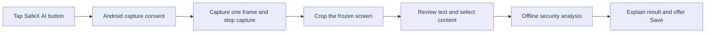

# SafeX AI floating assistant — implementation plan

Prepared: 9 October 2026. Status: **design reference for the 1.5.0 implementation**. See [implemented behavior and limits](floating-assistant.md); the verification report records the final test results. Some aspirational items below remain future work.

Next iteration: [full UX, detection and logo audit with prioritized enhancements](floating-assistant-enhancement-plan.md).

## Product goal

Give users a small SafeX AI shield button while using other apps. They can capture a screen or app with consent, crop the suspicious content, review extracted text or links, and run the existing offline security checks. Direct Share and selected-text actions remain available when capture is unavailable.

The button is available while the user enables it and Android allows the service to run. It is an on-demand tool: enabling it does not start screen recording, message monitoring, clipboard polling, or automatic scans.

## Existing project capabilities and gaps

| Area | Existing capability | Required change |
| --- | --- | --- |
| Links/messages | `ScanRepository.scanLink()` and `scanText()` use the existing rule/model pipeline | Add an explicit persistence policy and input provenance for floating scans |
| Image reading | `ImageContentReader` bundles Latin/Devanagari OCR and Gujarati Tesseract; it currently returns a combined string | Add a structured extraction result with line/word locations, reading order, coverage and quality status; reuse bitmap extraction for crops |
| Image bounds | Selected images are limited to 15 MB and decoded with a maximum dimension of 2,048 pixels | Crop before OCR resizing; bound capture memory independently; show partial/oversized outcomes instead of silent truncation |
| Exact selection | `TextSelectionProcessActivity` accepts Android's selected-text intent | Keep this route and explain that its availability depends on the source app |
| Shared content | `IntentRouterActivity` accepts shared text and images | Add a crop/review entry for shared screenshots; preserve the current direct routes |
| Results | `AnalysisResultContent` already has domain explanations, context questions, payment review and incident help | Provide a transient result mode; context edits in this mode must remain unsaved |
| History | `ThreatEventBus.emit()` calls `ThreatJournal.recordDurably()` | Separate analysis from persistence before introducing private floating scans |
| UI/languages | SafeX AI branding, English/Hindi/Gujarati and adjustable text size already exist | Reuse these resources for bubble labels, setup, cropping, review, status and errors |
| Platform | Minimum API 26, target/compile API 34; no overlay/capture services exist | Add optional overlay permission and separate service declarations for bubble lifetime and actual capture |

## User experience

### First-time setup

Settings → Floating assistant → Enable.

Show a short explanation: “Adds a movable SafeX AI button over other apps. Screen capture starts only when you choose it. A captured screen is held temporarily in memory so you can select an area; selected content is analyzed on your device.”

Open Android's display-over-other-apps settings, check the permission again on return, and start from the visible SafeX AI activity. Request notification permission with an explanation of status and warning notifications. If notifications are denied, show the actual limited notification state; do not claim that warnings will appear. Screenshot consent is requested when needed, rather than during onboarding. Manual scanning continues to work without enabling the button.

### Bubble and menu

Use the established teal shield/X symbol with a restrained dark outline. Provide a minimum 48 dp touch area, drag-to-move, edge docking, and a remembered normalized position that can be recomputed for changed screen bounds. A tap opens:

1. **Scan screen area** — capture, crop and review.
2. **Paste link or message** — open a focused SafeX AI input screen with an explicit Paste action.
3. **Pause assistant** — remove the bubble and stop its service.

Provide an accessible Move control and a visible Close action; drag-to-dismiss is an additional convenience. An idle teal icon means “assistant enabled,” not “this screen is safe.” Show brief progress only while work is happening. Avoid an endless pulse animation. Keep the idle overlay window small so it does not intercept unrelated touches. Hide it in SafeX AI's capture/review screens and while the device is locked.

### Capture and crop flow

1. User taps **Scan screen area**. Collapse and hide SafeX AI overlays.
2. Android presents its capture consent UI. Cancellation returns to idle with no scan or history entry.
3. After consent, capture one valid frame of the chosen app/screen. Wait for the requested content to be visible and the system prompt to be gone; a fixed sleep alone is insufficient.
4. Release the projection as soon as that frame is available, before the user edits the crop. Show a frozen image clearly labeled **Captured screen**.
5. Let the user drag and resize a rectangle, zoom the preview, reset the crop, or cancel. The rectangle applies to the captured image, not a moving live screen.
6. Confirm the crop. Discard the full-frame reference and run extraction on the selected region. Close image buffers deterministically; do not claim immediate forensic erasure of managed memory.
7. Display **Review extracted content** with selectable text, detected links and coverage information. Users can correct extraction errors before scanning.
8. User selects **Analyze message**, **Analyze selected text**, or one detected link. Analyze the selected input once through the shared pipeline.
9. Show the existing risk explanation, actual destination domain, context questions, relevant payment facts and incident help. Offer **Save result** explicitly. Closing returns to the source app and restores the bubble when enabled.

### Text/link selection routes

| Route | Best use | Behavior |
| --- | --- | --- |
| Crop a screen | A message, advertisement or link that cannot be copied | OCR produces reviewable content; users choose lines or links from the captured image |
| Native selected text | An app exposes Android text-processing actions | Long-press/select → Analyze with SafeX AI uses the original text |
| Share | Chat apps, browsers or image viewers expose Share | Send the chosen message/link/image to SafeX AI |
| Explicit Paste | The user has copied a link or message | Read only after the SafeX AI input screen has focus and the user taps Paste |

Do not promise that the bubble can directly select any live text in another app. Android's text-processing intent is a cooperative selected-text route, not an API for arbitrary screen contents. Clipboard access is also focus-restricted. [Selected-text API](https://developer.android.com/reference/android/content/Intent#ACTION_PROCESS_TEXT), [clipboard API](https://developer.android.com/reference/android/content/ClipboardManager#getPrimaryClip()).

## Android architecture

Use separate components for the persistent button and temporary capture. Keeping a button visible must not keep a projection session alive.

| Proposed component | Responsibility |
| --- | --- |
| `FloatingAssistantService` | Own the small overlay, drag/menu state, silent status notification and explicit stop action |
| `FloatingAssistantPreferences` | Store enabled preference, normalized position and appearance; keep actual running status separate |
| `ScreenCapturePermissionActivity` | Obtain fresh consent and handle result/cancellation using an activity-owned flow |
| `OneShotScreenCaptureService` | Manage the consented projection, virtual display, frame reader, deadlines and cleanup |
| `CaptureSessionStore` | Hold a bounded in-memory frame/crop behind an opaque session ID; no bitmap Intent extras |
| `CropScreen` | Display the frozen image and map crop coordinates accurately to source pixels |
| `ExtractedContentReviewScreen` | Present/edit OCR output, select text or a link, and disclose extraction coverage |
| `FloatingScanCoordinator` | Single operation at a time, cancellation, request IDs, routing, ephemeral analysis and explicit saving |
| `ExtractionResult` | Text blocks, bounds, script/engine, candidates, and completed/partial/failed status |

Place Android services and capture ownership in the app module, UI in the UI module, and reusable request/extraction contracts in core where appropriate. Avoid creating a second security engine or changing thresholds just for overlay inputs.

### Permissions and service types

Use `SYSTEM_ALERT_WINDOW` with `TYPE_APPLICATION_OVERLAY`. Recheck `Settings.canDrawOverlays()` at start/resume and handle revocation. Android can change an overlay's visibility or placement, and other apps can hide it. Therefore “continuously available” cannot mean visible over every protected screen. [Overlay window API](https://developer.android.com/reference/android/view/WindowManager.LayoutParams#TYPE_APPLICATION_OVERLAY), [overlay permission check](https://developer.android.com/reference/android/provider/Settings#canDrawOverlays(android.content.Context)), [hide overlays API](https://developer.android.com/reference/android/view/Window#setHideOverlayWindows(boolean)).

The actual capture service uses `FOREGROUND_SERVICE`, `FOREGROUND_SERVICE_MEDIA_PROJECTION`, and service type `mediaProjection`. Start its foreground lifecycle after consent, acquire the projection, register its callback before creating the virtual display, and release its resources on stop. Android 14+ requires fresh consent for each new session and single-use projection authorization. Handle selected-app captures and resize callbacks. [MediaProjection documentation](https://developer.android.com/media/grow/media-projection).

For a persistent bubble service, assess `specialUse` on API 34+: declare `FOREGROUND_SERVICE_SPECIAL_USE` and a precise `android.app.PROPERTY_SPECIAL_USE_FGS_SUBTYPE` describing the user-enabled cross-app security shortcut. This is a proposed fit, not guaranteed Play approval. Do not label idle time as media projection, data sync, camera, or remote messaging. Confirm the valid service design in the initial device spike and prepare its user-visible demonstration/declaration before a store release. [Service types](https://developer.android.com/develop/background-work/services/fgs/service-types), [Play foreground-service requirements](https://support.google.com/googleplay/android-developer/answer/13392821?hl=en).

Start/stop from explicit user actions. Android 15 narrows the overlay-based exception for starting services from the background; permission alone is insufficient. Prefer starting from the visible setup/permission activity. Test cross-app activity transitions and provide a tap-to-continue notification fallback if the device blocks a later transition. Do not silently restart capture at boot. [Android 15 behavior changes](https://developer.android.com/about/versions/15/behavior-changes-15).

The MVP needs no AccessibilityService, usage-access permission, screen-reading automation, clipboard listener, microphone, or broad photo-library permission. Image import can continue using the existing system-picker route. An AccessibilityService would introduce a different access model and additional disclosure/review obligations; it is unnecessary for these flows. [Accessibility API policy](https://support.google.com/googleplay/android-developer/answer/10964491?hl=en).

### Lifecycle and resource rules

Use explicit states: `OFF → IDLE → CONSENT → CAPTURING → CROPPING → REVIEWING → ANALYZING → RESULT`.

Define cancellation and permission-loss transitions from each state. Reject duplicate taps while a request is active. A cancelled request's late callback must not show a result. Release the image, reader, display, projection and service notification on completion, timeout, cancellation, lock or system stop. A dead process invalidates the in-memory session; show a clear rescan action rather than attempting to reuse authorization. A crop reset uses the same retained frozen image; a new capture requests a new session.

Keep the bubble status channel silent and separate from existing warning channels. Use the warning tune only for a completed suspicious result when the user has enabled warnings; do not sound it for starting capture, idle status, OCR errors or every update. A visible result should normally be sufficient without a duplicate alert. Keep lock-screen notification text generic.

## Extraction quality and honest results

1. Refactor the existing OCR reader to return structured text instead of discarding all geometry. Preserve original spelling, script and relevant suspicious Unicode characters.
2. Crop before OCR downsampling. Bound dimensions, allocated bytes and concurrency. Handle frame row-stride padding, app-window offsets, letterboxing, density and rotation with one tested coordinate transform.
3. Establish stable reading order; merge duplicate engine detections using geometry, not only whole-string equality. Mixed-script lines need explicit testing so overlapping English/Hindi/Gujarati extraction is not duplicated or lost.
4. Use text selection on the extracted image where word bounds are available. If an engine only yields line bounds, expose line selection rather than pretending to provide precise word selection.
5. Never silently change `0/O`, `1/l`, punctuation, spaces or domain characters in a suspected URL. Preserve the raw recognized candidate, label ambiguity and allow correction. Store edited input as user-reviewed text if saved.
6. An unreadable, blank, timed-out or partial capture means **could not fully analyze**, not a green result. A plain black image is not proof that a specific app blocked capture; use “Capture unavailable or unreadable.”
7. Disclose the existing maximum of eight analyzed embedded links and require choosing additional links separately. Add explicit overflow status for OCR beyond 12,000 characters instead of silently cutting it off.
8. Separate OCR readability/coverage from threat risk. Do not invent a universal OCR confidence percentage or treat a model score as probability of safety.
9. Analyze the full chosen message by default. When a user chooses only one link or fragment, state that scope in the result so omitted surrounding scam language is not assumed checked.
10. A screenshot shows visible text, not a browser anchor's hidden destination or future redirects. Display this limit for screenshot-derived links and offer the original link's Share/Copy route when possible.

Protected windows may produce unavailable/blank capture; some apps hide overlays. Respect those protections and offer exact-text Share/Paste or normal manual scanning when available. Do not bypass protected content. [Android sensitive-window guidance](https://developer.android.com/security/fraud-prevention/activities).

## Privacy and history design

Keep captured frames/crops in memory only. Avoid files, thumbnails, logs, analytics, crash attachments and saved-instance-state snapshots containing screen content. The full captured image exists temporarily before cropping; onboarding must describe this accurately. Discard unselected image data once cropping is confirmed. Preserve the current absence of INTERNET permission.

Refactor analysis into a reusable non-persisting path with a `ScanRequest` or equivalent explicit policy: input kind, input provenance, analysis scope and `savePolicy = EPHEMERAL | SAVE`. Keep current app behavior through a compatibility wrapper; the floating flow defaults to `EPHEMERAL`. Avoid “save then delete” because the data has already been persisted and exposed to observers.

Context/payment reviews must obey the same policy. `AnalysisResultContent` currently writes through `ThreatJournal`; provide an injected review/save callback or session state so a private result stays private after edits. Save only upon the user's explicit action, once per result ID. Saved entries can record source “Floating screen crop,” OCR/user-edit provenance and coverage; omit image pixels and the original full screen. Respect existing retention/delete controls. User text must be reviewed before it is saved.

## UI and accessibility requirements

Reuse SafeX AI's navy/teal theme, existing logo, translated catalog and text-scale preferences. Translate all trusted setup, permission, crop, preview, status, result and recovery copy into English/Hindi/Gujarati. Leave user content and domains untranslated.

Provide large crop handles, a magnified preview for fine adjustment, zoom/reset controls, a clear selected-region border and an accessible alternative for users who cannot drag precisely. Offer a “Use captured image” selection option explicitly, with the wider scope disclosed. Test TalkBack movement controls, keyboard focus and 150% text size. Use icon plus text for result states, and bounded scrollable review screens rather than trying to fit every result into a small overlay panel.

## Delivery sequence

Planning estimate for one experienced Android developer: **5–8 working days**, subject to device behavior and capture/service feasibility. This is an estimate, not a measured implementation duration.

| Phase | Work | Exit condition |
| --- | --- | --- |
| 0: platform spike | Real overlay lifetime, correct foreground types, capture consent, source-app frame timing and UI transitions | One-shot capture works on a target-34 device and a newer OS; denial/stop cleanly recover |
| 1: bubble foundation | Opt-in setup, service, drag/dock, Pause/Stop, silent notification and focused Paste | Bubble does not intercept outside touches, and stopping releases it immediately |
| 2: capture/crop | One frame, memory limits, transforms, frozen-image crop and cancellation | Selected pixels match the preview in portrait/landscape and app/window captures |
| 3: extraction/review | Structured multilingual OCR, editable text/candidates and shared ephemeral pipeline | Correct scope is scanned; no automatic database writes or unsafe link opening |
| 4: hardening/demo | Permission revocation, lock/process death, device coverage, accessibility, latency and recovery demo | Acceptance matrix passes with evidence; measured limitations documented |

For a tight hackathon deadline, prioritize one-shot crop → review → analysis, focused Paste and native Share/selection, three-language UI, and reliable Stop. Defer live continuous scanning, automatic app inspection, extensive gesture customization and complex multi-region batching. Retain a shared-screenshot → crop route for devices where the bubble/capture flow is unavailable.

## Verification and acceptance

| Area | Checks and expected outcome |
| --- | --- |
| Permission denial/revocation | Setup cancelled, overlay access revoked mid-flow, capture declined, notifications denied: no crash; recovery actions match actual state |
| Capture identity | Capture the originating app instead of SafeX AI, its bubble or the consent UI; validate app-only and whole-screen choices |
| Capture controls | System stop, screen lock, competing capture and process death cancel cleanly; new sessions always request fresh consent |
| Protected/blank content | No bypass and no “safe” result; Share/Paste/manual alternatives shown |
| Geometry | Portrait/landscape, status/navigation insets, three-button/gesture navigation, display scaling, letterboxing and resized windows select the correct pixels |
| Multilingual extraction | Authored English/Hindi/Gujarati and mixed-script fixtures; dense text, dark/light themes, low contrast and small fonts |
| Fraud cases | Look-alike domains, userinfo before `@`, Unicode confusables, QR/UPI content, urgency/OTP scam text, multiple URLs and benign examples |
| Scope/overflow | More than eight links, excessive OCR, fragments missing message context and ambiguous links have visible coverage limits |
| Persistence | No frames in files/cache/logs; no database entry from capture, analysis or context edits until Save; Save idempotent; existing history still works |
| Interaction | Drag does not trigger a scan; outside touches work; button position remains valid; Pause/Stop works; source-app Back behavior is sensible |
| UI | All three languages at 100%/150%, TalkBack, large crop handles and no reliance on color alone |
| Alerts | Silent assistant status, existing warning tune on intended completed warnings only, no duplicate alert, DND/user channel choices respected |

Use unit tests for crop transforms, selection ordering, ambiguity/overflow routing and persistence policy. Native tests must exercise actual consent/capture rather than injecting screenshot data as proof of platform capture. Use a controlled companion screen with authored content for repeatable cross-app tests, then manually verify representative browser/chat apps and protected-window behavior.

Cover API 26 as the minimum baseline and behavior boundaries at 29, 31, 33 and 34; add device checks on Android 15/16 and the current release used for distribution. At least one reference Android device and two vendor devices should pass the main flow. Complete current Play target/service requirements separately before a store submission.

Initial engineering targets, to be measured rather than advertised as achieved: idle assistant performs no recurring OCR/capture/clipboard reads; menu responds within 200 ms on the demo device; capture completes or explains a timeout within 10 seconds after authorization; warm Latin OCR plus analysis aims for p95 ≤4 seconds on the reference device, with separate Hindi/Gujarati measurements. Record stage timings, memory and cancellation behavior without recording content. OCR/model accuracy must be evaluated separately; a working overlay is not an accuracy improvement by itself.

## Mentor demonstration

1. Enable the floating assistant and show its stop notification.
2. Leave SafeX AI and open an authored scam message in a companion chat/browser screen.
3. Tap the shield, consent, crop only the relevant message and show the extraction review.
4. Analyze the message and explain the domain/pressure/secret-request evidence.
5. Repeat with a benign sample, without claiming that an absence of signals guarantees safety.
6. Show a denial/unreadable outcome and the Share/Paste fallback.
7. Demonstrate private review without a history entry, then explicit Save.
8. Switch to Hindi/Gujarati and larger text; finish by stopping the floating assistant.

Pitch: **“SafeX AI lets users check suspicious content at the moment they encounter it. They choose the screen area or text, review what will be analyzed, and receive an explanation from the same offline security engine.”**
