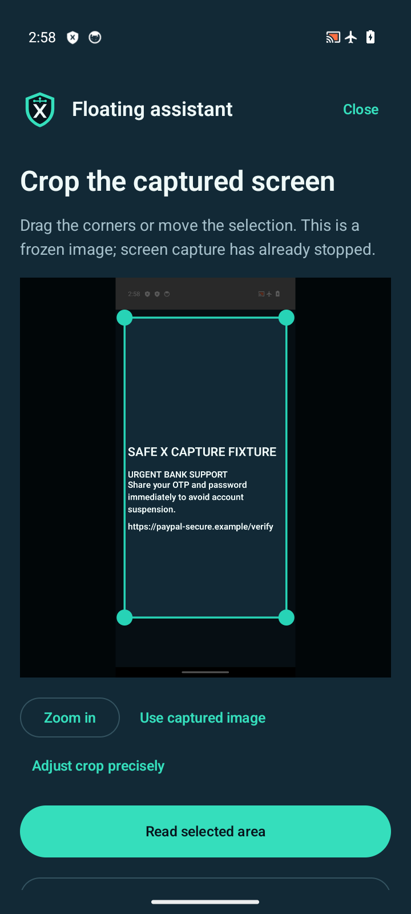
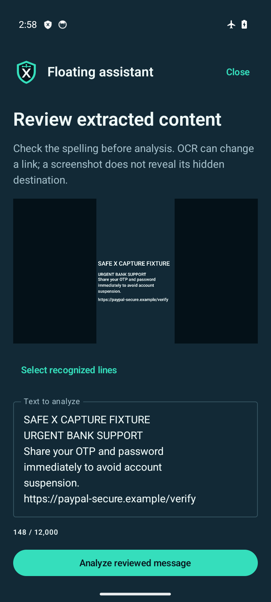
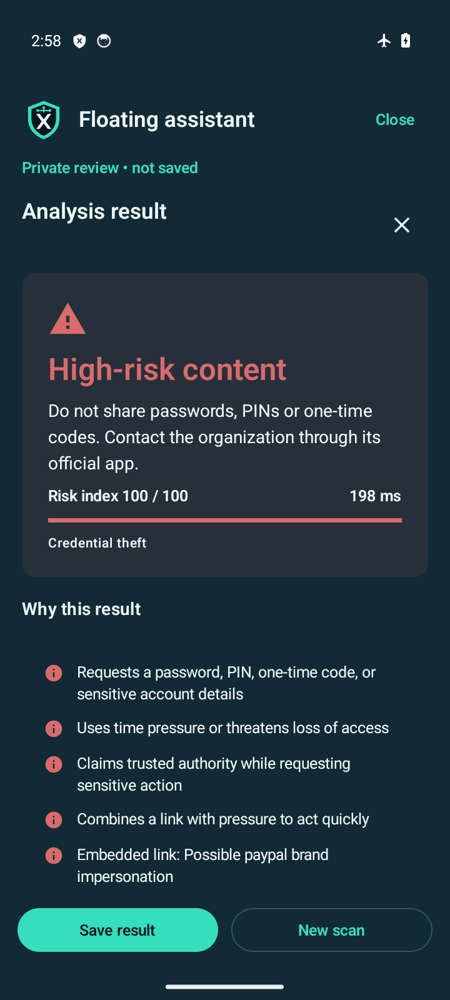

# SafeX AI 1.5.0 — floating security assistant

The floating shield gives users an on-demand way to check content encountered in other apps. It does not continuously record the screen or read other apps. Android must allow overlays, and each screen capture requires a fresh system consent prompt.

## Enable and use

1. Open **Settings → Floating assistant → Set up floating assistant**.
2. Choose **Enable floating assistant** and grant Android's display-over-other-apps permission. Notification permission is optional; enable it for status and background warnings.
3. Leave the assistant screen. Tap the movable SafeX shield over another app. Drag it to either edge or use **Move to other edge**; its position is remembered.
4. Choose **Scan screen area**, approve Android's prompt, and select the intended app or entire screen if Android offers that choice.
5. Adjust the frozen image with corner handles, drag the selection, zoom, or use the four precise crop sliders. Tap **Read selected area**.
6. Review and correct the extracted text before analyzing. Tap recognized image lines or use the checkbox list to choose a fragment. Alternatively, choose a detected link or QR payload. Nothing opens automatically.
7. Read the existing domain, payment, risk and context explanations. This review remains private until **Save result** is pressed.

The menu also offers **Paste link or message**, **Choose screenshot**, **Resume private review**, **Pause assistant**, and **Close**. Clipboard reads occur only after pressing Paste in a focused input screen. The image picker grants access to the selected image; broad photo-library permission is not requested.

The shield is a shortcut, not a safety indicator. Android or the device manufacturer may hide it or stop its service. Start it again from settings when needed; it does not restart at boot.

## Interface examples

These screenshots use authored demonstration content:

| Crop captured content | Review extracted text | Private risk explanation |
| --- | --- | --- |
|  |  |  |

[English at 150%](screenshots/floating-assistant/setup-en-150.png) · [Hindi at 150%](screenshots/floating-assistant/setup-hi-150.png) · [Gujarati at 150%](screenshots/floating-assistant/setup-gu-150.png)

## Private capture and analysis

The shortcut service and capture service have separate lifetimes. The idle shortcut uses a `specialUse` foreground service with a persistent, silent status notification. Actual capture uses a `mediaProjection` foreground service and a fresh authorization token. It registers the required callback, waits for the helper activity to leave the foreground, reads one frame, and releases the projection before showing crop controls. Capture has a ten-second timeout. The service owns the authorized request independently of the gateway activity, which Android can destroy after it leaves the foreground. A new review activity consumes the frame exactly once. Application-level screen-lock cleanup covers that interval, and delivery rejects frames while the device is locked.

The full authorized frame exists temporarily in RAM so the user can crop it. Only cropped pixels are sent to bundled Latin, Devanagari and Gujarati OCR and the bundled QR decoder. Recognized lines retain image coordinates. Conflicting readings from different scripts remain available for correction; a native-script misread cannot erase English credential tokens or silently change a URL path’s case. Pixel-buffer packing handles row padding and a truncated final padding row found on some devices. Unchanged-size capture callbacks keep the original reader, avoiding unnecessary frame loss on static screens. Full frames, crops and edited content are not uploaded, written to capture files or included in notifications. The assistant preview is protected from screenshots and recent-task thumbnails with `FLAG_SECURE`.

Unclaimed frames expire after one minute. An open private session expires after two minutes in the background; the deadline is also checked on return in case Android suspended the process. Closing, canceling or locking the screen clears the session. Process death does not restore captured pixels or private text. Explicitly saved results persist in local history using the existing retention and deletion controls.

Private link, text and QR analysis calls the existing local pipeline without emitting a history event. Context questions and expected payment comparisons can increase caution in the private result without saving it. **Save result** is the explicit persistence boundary. Existing ordinary scan routes retain their history behavior. Older history snapshots cannot remove stronger risk evidence or context answers already displayed for the same result.

Risk warnings completed in the background can use the existing review/urgent notification channels and SafeX warning tune. Capture and idle status notifications are silent. Android controls permission, channel sound, notification volume and Do Not Disturb; no audio or alarm bypass occurs.

## Supported selection and bounds

- Crop, editable recognized text, individual recognized lines, individual detected links, and individual QR payloads.
- English, Hindi and Gujarati recognition independent of the chosen interface language.
- All new trusted interface copy translated into English, Hindi and Gujarati; existing 85–150% text sizing and SafeX navy/teal branding reused.
- Capture bounded to 4,096 pixels on the longest edge and six million pixels; imported images bounded to 15 MB and sampled to the same memory limits.
- At most 12,000 text characters, 250 recognized lines and eight QR candidates in an extraction result. Partial extraction is disclosed and cannot yield an unconditional allow result.
- Individual detected links are checked independently of surrounding message text. Scan coverage records which content was analyzed.
- Empty, oversized, timed-out and unreadable input produces a recovery message rather than a successful safety verdict.

## Real-world limits

Screenshots contain visible text, not hidden hyperlink destinations. OCR can alter domains, punctuation or numbers; users must review the text. Mixed-script, low-resolution, compressed, rotated and stylized content can be missed. Correct extraction and a risk explanation are not a guarantee that a message or website is legitimate.

Protected screens and apps that suppress overlays are respected. SafeX AI has no accessibility reader, notification-redaction bypass or secure-screen bypass. Use the source app's Share/selected-text action or paste the original content when capture is unavailable. A partially protected screen can expose surrounding controls while hiding the sensitive content; only selected readable content is assessed.

No network reputation lookup, DNS lookup, redirect following or webpage inspection is performed. The URL and text model artifacts are unchanged by this release. See the [model card](ml-model.md) for dataset and evaluation limits. Functional tests do not establish 100% or current-world phishing accuracy.

## Hackathon rehearsal

Use an authored message containing an unexpected OTP/password request and a clearly synthetic URL such as `https://paypal-secure.example/verify`. Enable airplane mode, show the floating shield over the message, approve a fresh capture, crop it, correct any OCR mistakes, analyze privately, and show that history changes only after Save. Repeat with Hindi/Gujarati and larger text. Decline a capture to demonstrate the recovery path. Test warning-channel audio on the actual presentation phone.

## Implementation references

- [Android MediaProjection requirements](https://developer.android.com/media/grow/media-projection)
- [Foreground-service types and special use](https://developer.android.com/develop/background-work/services/fgs/service-types)
- [Android 15 background-start behavior](https://developer.android.com/about/versions/15/behavior-changes-15)
- [Android fraud prevention and protected activities](https://developer.android.com/security/fraud-prevention/activities)

A Play Store release needs the foreground-service declaration and review for this use case. `specialUse` approval has not been obtained. Device tests cover the recorded emulator configuration; manufacturer-specific background limits and physical-device behavior require further testing.

## Verification

The final 1.5.0 debug APK passed **500 active unit tests** (503 discovered; three optional research-export tests skipped) and **35 Android device tests in airplane mode**. The native suite took 171.361 seconds; this is suite duration, not a scan-latency benchmark. Android lint reported **zero errors and 51 warnings**. All 714 translated interface strings have matching English/Hindi/Gujarati keys and placeholders.

[Installable APK](../android-app/app/build/outputs/apk/debug/SafeX-AI-1.5.0-debug.apk) · [Verification summary](test-results/floating-assistant-summary.json) · [Final build output](test-results/floating-assistant-final-build.txt) · [Device test output](test-results/floating-assistant-native.txt) · [Capture lifecycle evidence](test-results/floating-assistant-capture-diagnostics.txt)

APK version code: 6. Development debug signing; size: 134,569,534 bytes. SHA-256:

```text
2e0667b7815925f6cd554407a17d64d433fb9672eb3f6be1bde5015e61645309
```

The final tests verify the static-screen capture path after preserving its frame reader on unchanged-size callbacks, and regression tests verify that stale history snapshots cannot lower an already displayed risk score or erase context warnings. Functional authored-fixture tests do not certify detection accuracy. Physical-phone behavior, physical warning-sound playback and Play Store foreground-service approval remain unverified.


To reproduce the camera portion on the tested emulator, copy the fixture to a path without spaces. The emulator's internal camera-name parser truncates imagefile paths at spaces even when the shell argument is quoted:

```sh
cd android-app
cp app/src/androidTest/assets/camera-qr.png /tmp/safex-camera-qr.png
emulator -avd SentinelDemo -camera-back imagefile:/tmp/safex-camera-qr.png
adb shell cmd connectivity airplane-mode enable
adb shell am instrument -w -e safexCameraFixture true com.sentinel.ai.test/androidx.test.runner.AndroidJUnitRunner
```

The capture tests drive the actual Android consent prompt and ImageReader. They display authored fixture content, crop the captured pixels, run the real bundled OCR and analysis pipeline, check that projection has stopped, and explicitly save/delete the result. Instrumentation temporarily clears screenshot protection only on its own authored test screens to export visual evidence; production preview protection remains enabled.
